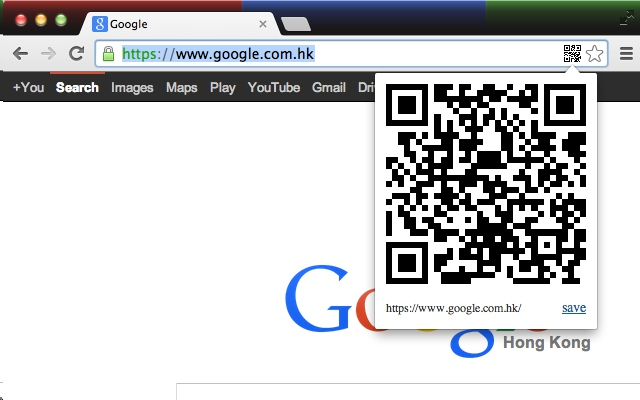

推荐几款自己正在使用的插件，推荐等级与顺序无关。

## 1. Anything to QRcode

通过右键菜单或地址栏按钮将当前页面地址、选中的文本、链接、图片地址等文本内容生成二维码，也可以解析页面中的二维码图片，完全离线可用，不依赖任何远程文件和服务，内存占用小，不常驻后台，界面简洁，无广告。

作者用于测试 web 适配，当开发的网页需要用手机测试时，不再需要手动输入二维码，用此插件生成二维码后手机扫码访问即可。
<!-- more -->
 
 

## 2. Infinity 新标签页

Infinity新标签页，基于Chrome的云应用服务，让你更优雅、轻松地使用Chrome。

 

## 3. JSON-handle

对JSON格式的内容进行浏览和编辑，以树形图样式展现JSON文档，并可实时编辑。

 

## 4. Octotree

Extension to show code tree for GitHub.  
 
 Features:
 * Easy-to-navigate code tree like IDEs
 * Support private repositories
 * Support GitHub Enterprise
 
Learn more about Octotree: https://github.com/ovity/octotree

 

## 5. ~~Postman~~

Supercharge your API workflow with Postman!
Postman Chrome 插件已停用了，可下载 PC 客户端。[下载](https://www.getpostman.com/apps)

 

## 6. FeHelper

FE助手：包括JSON格式化、二维码生成与解码、信息编解码、代码压缩、美化、页面取色、Markdown与HTML互转、网页滚动截屏、正则表达式、时间转换工具、编码规范检测、页面性能检测、Ajax接口调试、密码生成器、JSON比对工具、网页编码设置、便签笔记

