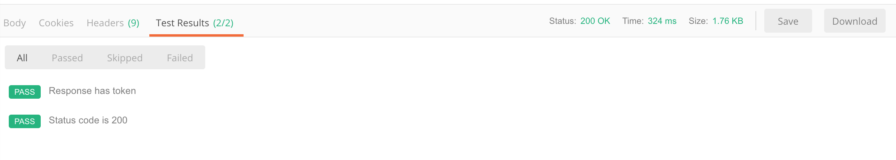

在我们日常开发中经常需要用到登录授权，大多接口都需要携带 Auth 信息。在 Postman 中调试接口时发送登录请求后再复制粘贴 Token，麻烦。Postman 的 Scripts 功能可以较好的解决这个问题。

官文：<https://learning.getpostman.com/docs/postman/scripts/intro_to_scripts/>

## Test scripts

Test scripts 是在请求结束后运行的 JavaScript 脚本。在登录请求结束后将 Token 设置到[环境变量](https://learning.getpostman.com/docs/postman/environments_and_globals/intro_to_environments_and_globals)中，在需要 Auth 的接口中取用变量。

### pm.test

`pm.test(testName:String, specFunction:Function):Function` 可以用来确认 Response 是否和预期返回的一致。

| param | description |
| :------- | :---------- |
| testName | 测试名，在 **Test Results** 面板中显示 |
| specFunction | 测试执行函数 |

首先确认 Request 是否请求成功，HTTP 状态码为 200。

```JavaScript
pm.test("Status code is 200", function() {
    pm.response.to.have.status(200);
})
```

接着判断 Response 是否如期返回 token。如果有返回就设置到环境变量中，如果没有就不管了。

```JavaScript
pm.test("Response has token", function() {
    pm.response.to.have.jsonBody("token");
    // 如果上面断言不通过，下面的语句不会执行
    const token = pm.response.json().token;
    pm.environment.set("token", token);
})
```

合并。

```JavaScript
pm.test("Status code is 200", function () {
    pm.response.to.have.status(200);
    pm.test('Response has token', function() {
        pm.response.to.have.jsonBody("token");
        const token = pm.response.json().token;
        pm.environment.set("token", token);
    })
})
```




## Variables

经过上述的 Test scripts 已经将登录请求得到的 token 设置到了环境变量中。现在在需要验证 Auth 信息的请求中引用变量，以 Authorization为例。

变量引用有两种方式，一种是通过 `{{variableName}}` 的形式访问，这种形式只能在 Request Builder 中使用，也就是只能在 URL、Params、Authorzation、Headers、Body 中使用，另一种是通过 Scripts 访问，如上述用到的 `pm.enviroment.set(variableName:String, variableValue:String)`。更多查阅官文：<https://learning.getpostman.com/docs/postman/environments_and_globals/variables>

Authorization 🌰：


## More

Postman 的功能很强大，灵活应用可以很好提高工作效率和质量。比如灵活使用 [Environment](https://learning.getpostman.com/docs/postman/environments_and_globals/intro_to_environments_and_globals) 可以方便的在测试和生产环境切换，使用 [Scripts](https://learning.getpostman.com/docs/postman/scripts/intro_to_scripts) 可以实现依次发送多个请求，或者 token 失效后自动刷新 token。活学活用查阅官文：<https://learning.getpostman.com/docs>